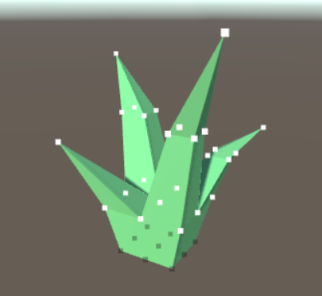
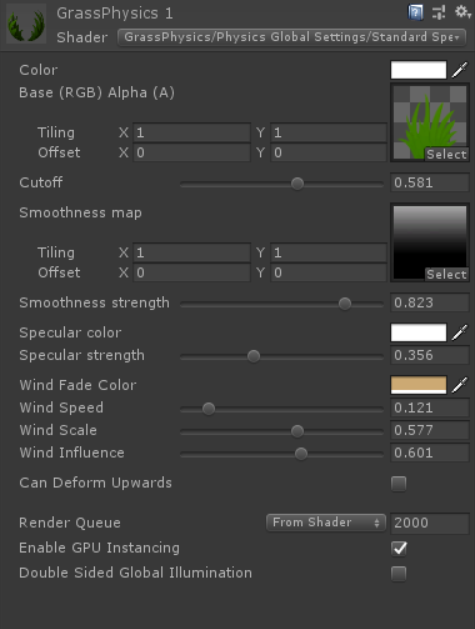
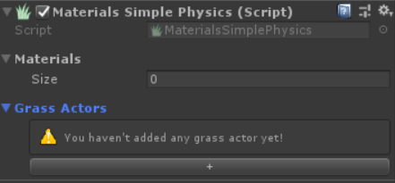
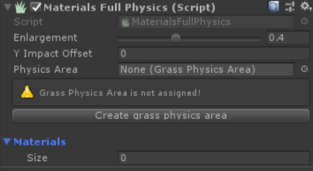
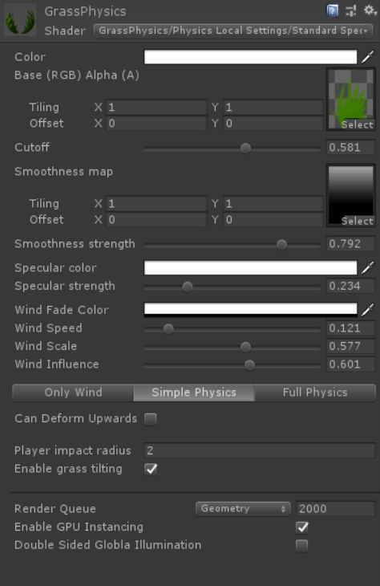

# Physics For Custom Meshes

> *Grass Physics Asset* is easy to use with *Unity Terrain's* grass, but it can be also used with any mesh. If you have model of grass, vegetation or any object that you cannot use as grass in *Terrain* component and you want it's physics to be simulated by this asset just follow the steps in following subsections.

### Preparing your Mesh for Physics deformation
> Physics shader works basing on vertex displacement. When we bend the grass simulating the wind or impact of some object we don't want some vertex to move. For grass in example it's the bottom part that is near the ground. To inform shader which vertices should not move *Terrain* component marks them with "vertex color" and the vertices that should not move have "vertex color" with alpha value equal to 0.

> So Unity Terrains Grass meshes have automatically correctly painted vertices. Custom meshes has to follow similar rules, so if you want some of vertices in your model not to move you have to get them "vertex color" with 0 alpha value.

> To do this you can use tools like <a href=https://unity3d.com/unity/features/worldbuilding/polybrush>Polybrush</a>, or use this simple open source script that I prepared for you <a href=https://github.com/ShadedTechnology/MeshPainter>MeshPainter</a>.

### Global settings materials
> If you want your custom meshes physics settings be the same as global grass settings, create new Material with one of the shaders that are in "GrassPhysics/Physics Global Settings/". Than adjust the material according to your prefferences and attach it to your *MeshRenderer*. If you don't have [Grass Manager](/GrassManager.md) component in your scene than create that and configure phyics mode which you want to use. After that your mesh should react like the Terrain's grass.

> What is different from standard shaders in physics global shader are wind settings. That are:
> - *Wind Fade Color* material color tint caused by wind (alpha channel specifies its strength)
> - *Wind Speed* speed of simulated wind
> - *Wind Scale* scale of winds noise size
> - *Wind Influence* tells how much wind moves vertices

### Local settings materials
> If you want be able to specify physics settings separately for every of your material you can use for it one of "GrassPhysics/Physics Local Settings/" shaders.  
They have simmilar properties like ”Grass-Physics/Physics Global Settings/" materials but additionally they have also physics settings with ability to specify physics mode. Using this materials you can use many physics modes for them at the time. 

> Although for this materials to physics work properly you have to create *MaterialPhysicsComponent* and attach this materials to proper component.

> For *Simple Physics* use *MaterialsSimplePhysics* component

> For *Full Physics* use *MaterialsFullPhysics* component

> Example material with physics local settings shader

