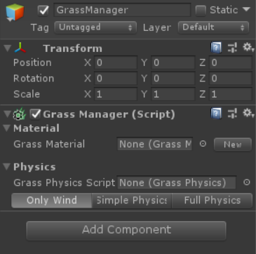

# Grass Manager

> *GrassManager* component lets you manage grass material and grass physics 
settings in your scene. Make sure to have only one *GrassManager* component in your scene.

> GrassManager consists of two parts:
- [Material](GrassMaterial.md)
- [Physics](GrassPhysics.md)

They will be discussed in following sections.
