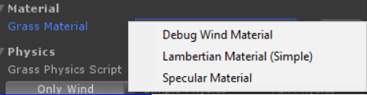
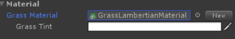
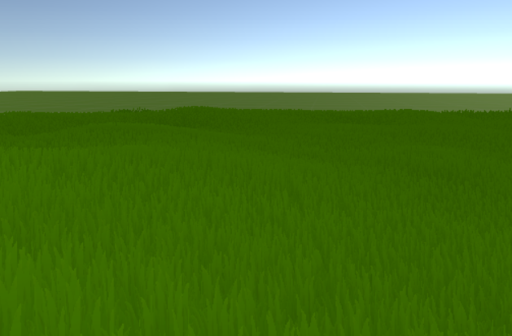
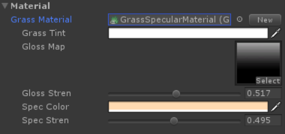
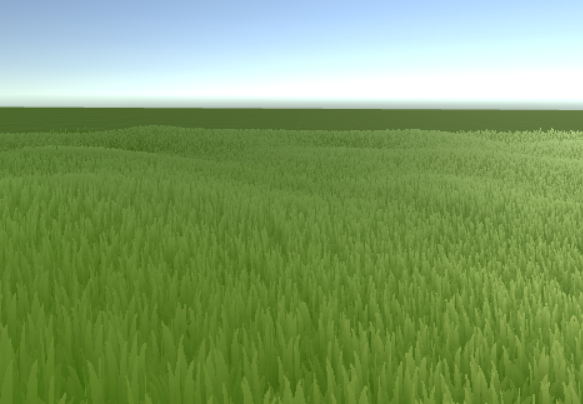
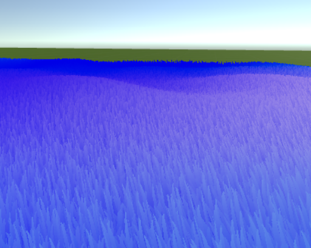

# Grass Material

> *GrassMaterial* is a ScriptableObject that let you specify grass material data and stores it.  

### Creating new grass material
> To create new grass material press *New* button and select type of material you want to create.

> There are three types of material:
- [Lambertian Material](#Lambertian-Material)
- [Specular Material](#Specular-Material)
- [Debug Wind Material](#Debug-Wind-Material)

### Lambertian Material
> *Lambertian Material* is default material type used by build-in unity grass. It is efficient and works great with mobiles, but does not support specularity. When *GrassMaterial* is set to null, *Lambertian Material* is used.

> It has one modifiable property *Grass Tint* which controls tint of grass color.

### Specular Material
> *Specular Material* is material with implemented specularity. It is good in imitating real-life grass translucency. 
It might not work on some mobiles or older devices.

> It has following properties:
> - Grass Tint - tint of grass color
> - Gloss Map - texture map of grass glossiness
> - Gloss Stren - glossiness strength
> - Spec Color - specular color
> - Spec Stren - specular strength

### Debug Wind Material
> *Debug Wind Material* is material used for debugging purpouses. It shows how wind affects the grass.

