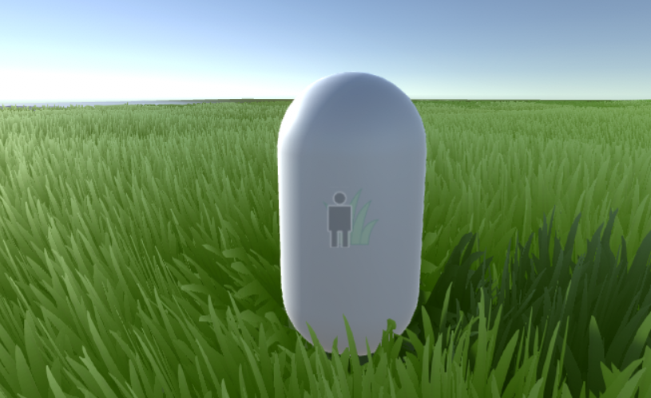
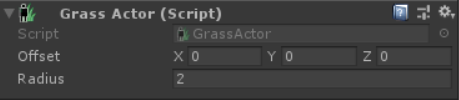
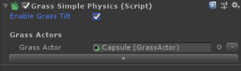
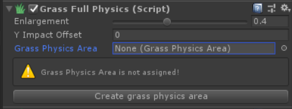

# Grass Physics

## Grass Physics Modes
> You may have already noticed that in *GrassManager's* "physics section" are three tabs. That are three physics modes from which you can choose one at the time. This modes are:
> - [Only Wind Mode](#Only-Wind-Mode)
> - [Simple Physics Mode](#Simple-Physics-Mode)
> - [Full Physics Mode](#Full-Physics-Mode)

### Only Wind Mode

> It is the simplest mode which doesn't add any physics effect to grass except from standard built-in wind.  
(Basically with this option physics for grass is turned off).

### Simple Physics Mode

> Simple Mode apart from wind also simulates grass bending caused by *GrassActors*.  
*GrassActors* are components that make GameObject affect the grass in *Simple Physics Mode*.
*Simple Physics mode* is lighter than *Full Physics mode* so it can also run on mobiles.

> *GrassActor* component has following fields:
> - Offset - position offset from center of the GameObject
> - Radius - radius in which Object affects the grass

> To add *GrassActors* to your scene firstly add *GrassActor* component to all GameObjects you want to affect the grass. You can do it by clicking *Add Component* button and then *Grass Physics > GrassActor*. After that go to your *GrassManager*, below it you should see *GrassSimplePhysics* component. Click on "**+**" button to add field on *GrassActors*. Do it as many times as many *GrassActors* you want to have (default max *GrassActors* is 10. To change it you can modify constant *MAX_GRASS_ACTORS* in file "GrassPhysics/Scripts/HelperClasses/HelperClasses.cs". For changes to by applied, Unity may have to be restarted). Next drag and drop Objects with *GrassActor* component to fields you just created.  
If you created to many *GrassActors* fields you can click the "**-**" button to remove them.

> *Simple Physics Mode* have also checkbox with option named *Enable Grass Tilt*. When it is disabled grass can only bend verticly (except wind impact) and not horizontaly, with this option enabled grass can bend also horizontaly. I recomend you to test turning on and off this option to see which works best for you.

### Full Physics Mode

> *Full Physics Mode* is the most complex one from the three of physics modes. It simulates vertical grass bending caused by every mesh that's inside [Physics Area](GrassPhysicsArea.md) (you can select which layer of meshes you want to ignore, more will be explained in [Physics Area](GrassPhysicsArea.md) section).

> When you select *Full Physics Mode* in *GrassManager* component, you should see *Full Physics* component added to your GameObject like shown below.

> *GrassFullPhysics* component has following fields:
> - Enlargement - how much should enlarge mesh's field of impact on grass.

> - Grass Depth Offset - offset of mesh's impact on grass in Y axis.

> - [Physics Area](GrassPhysicsArea.md) - component with area where grass is effected by physics.

If you don't have GameObject with [Physics Area](GrassPhysicsArea.md) component created yet, you can click on *"Create grass physics area"* button below and it will automatically create it for you. Than set up parameters in [Physics Area](GrassPhysicsArea.md) component according to instructions in the [Physics Area](GrassPhysicsArea.md) section.