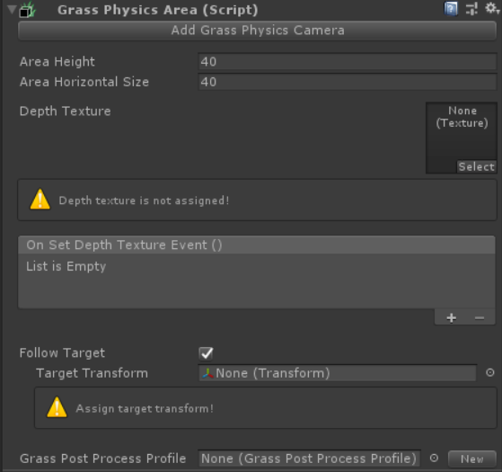
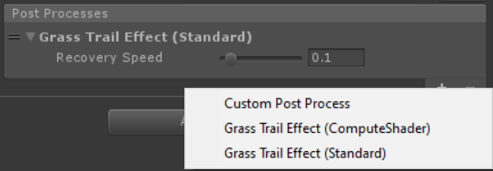
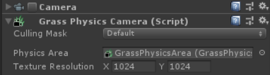
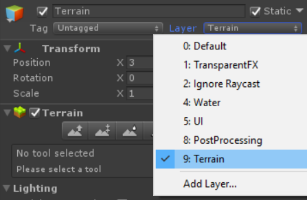

# Grass Physics Area

> To simulate grass physics in "full physics" mode you need *GrassPhysicsArea* component. It represents the area in which grass physics is simulated.  
You can set parameters of this area like its size, whether the area should follow the player or if grass deformation should be lasting.  
For the grass area to follow the player you have to check the "Follow Target" box, next assign player transform to the "Target Transform" property, and than property "Area offset" should appear in which you can specify the offset with which the area should follow the player.  
To make grass deformation last longer create post process profile with *Trail Effect*.

> *GrassPhysicsArea* component has following fields:
> - Area Height - the height of area in which grass physics is simulated.
> - Area Horizontal Size - horizontal size of area in which grass physics is simulated.
> - Depth texture - depth texture based on which grass is deformed.
> - On Set Depth Texture Event - event called before depth texture is sent to shader. (for advanced users: ie. you can add to this event function in which you update the depth texture).
> - Follow Target - determines if the area should follow the transform you specify  
&#8226; Target transform - transform which the area should follow  
&#8226; Area offset - offset with which the area follows target (Destination position of the area is targetTransform.position + offset). 
> - Grass Post Process Profile - scriptable object with list of post processes performed on grass deform depth texture.  

> Grass deformation simulation is based on "depth texture" so you can set the resolution of this texture. You can also set the depth texture itself, but if you want "physics like" grass deformation you don't need to do it yourself and [Grass Physics Camera](#Grass-Physics-Camera) component will do it for you. To attach [Grass Physics Camera](#Grass-Physics-Camera) component to your *GrassPhysicsArea* simply click "Add Grass Physics Camera" button.

## Grass Physics Camera

> *GrassPhysicsCamera* creates and updates depth texture for your [Grass Physics Area](#Grass-Physics-Area).  
It has following properties:
> - *Physics Area* field where you can specify which physics area will be attached to this component*Culling Mask*.
> - *Culling Mask* is the property where you can specify which layers will impact grass bending. For grass full physics to work properly you have to set your terrain to the layer that is not included in the *Culling Mask* property.
> - Texture Resolution - resolution of depth texture.

