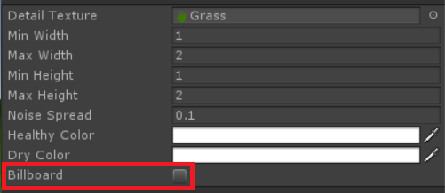

# Preparing grass for physics asset

### If  you  have  already  Unity  buit-in  grass  in  yourscene

> If you have implemented Unity built-in non-billboardgrass in your scene 
than you’re ready to implement GrassPhysics asset! Go to the next section 
[Setting up grass physics asset](/SettingUp.md).

### If you don't have grass in your scene
> If you don't have grass in your scene, than create new *Terrain* GameObject and select 
*Paint Details* section at Terrain component. Add grass texture which you want to have in 
your scene and make sure to **uncheck Billboard** option in *Add Grass Texture* selection window. 
Than paint your grass on terrain.

  Make sure to uncheck Billboard option in your grass texture.
