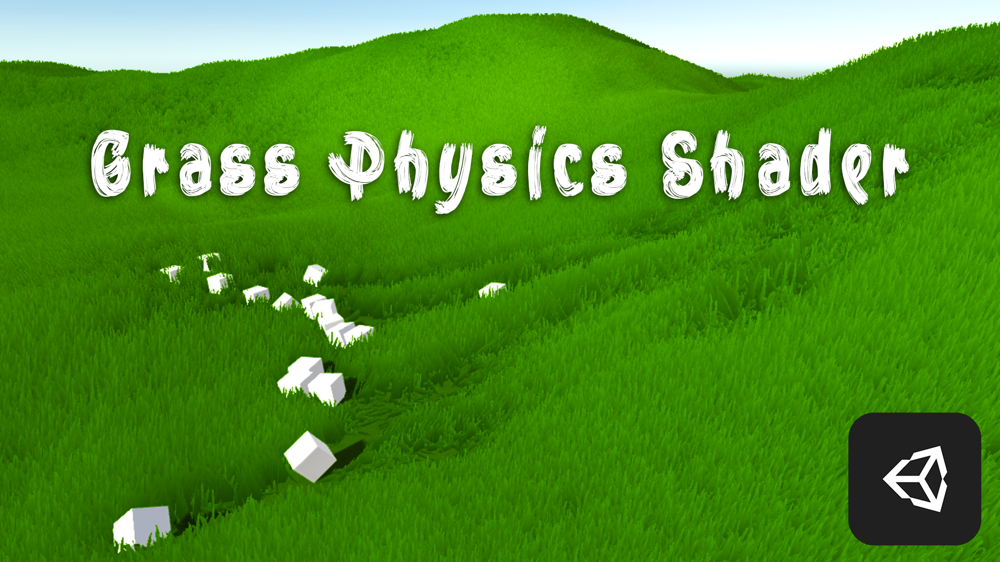

# Grass Physics Shader

### About
> [Grass Physics Shader](#Grass-Physics-Shader) is a tool for standard terrain 
that can simulate grass physics and interaction with 
meshes using custom shader.

### Get Started

 <a href="#/PreparingGrass" style="text-decoration: none;"
onmouseover="this.getElementsByTagName('span')[0].style.backgroundColor='#42b983aa';"
onmouseout="this.getElementsByTagName('span')[0].style.backgroundColor='#42b983';"
>Go to Set Up section</a> 

### Features:
* Easy to use (just few clicks to set up)
* DirectX 11 is not required
* Highly customizable
* Very slight impact on performance
* You can implement this to your existing project with unity terrain and grass
* Multiple terrain support
* Advanced grass material options
* Two physics modes in one package:
  - [Simple Physics Mode](#simple-physics-mode) -
 For efficient and lightweight grass physics simulation.   

  - [Full Physics Mode](#full-physics-mode) -
 For full grass physics simulation.   

### Contact:

