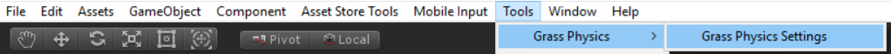
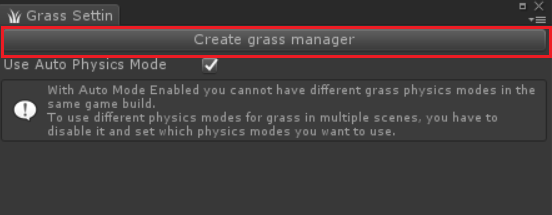

# Setting up grass physics asset

## Adding [ Grass Manager](/GrassManager.md) Component to your scene
> First thing you have to do to setup Physics Grass Asset in your scene is to add 
[Grass Manager](/GrassManager.md) component to your scene. You can do it on different ways.

#### First method: 
> Open [Grass Physics Settings](/GrassPhysicsSettings.md) window via the toolbar 
**Tools > Grass Physics > Grass Physics Settings**, then press the *"Create grass manager"* button. 
After that GameObject called [Grass Manager](/GrassManager.md) should appear in your scene hierarchy.

#### Second method: 
> Create new empty *GameObject*, than click *AddComponent* button and select 
**Grass Physics > GrassManager**.

#### Either way you should end up with GameObject that have [ Grass Manager](/GrassManager.md) component.
