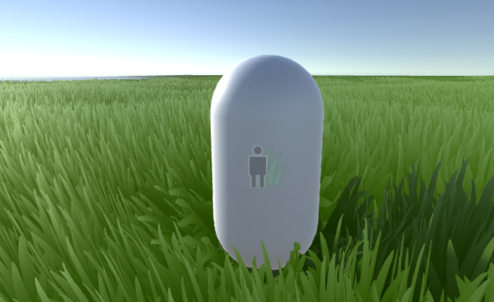

# Simple Physics Mode

> Simple Mode apart from wind also simulates grass bending caused by *GrassActors*.  
*GrassActors* are components that make GameObject affect the grass in *Simple Physics Mode*.
*Simple Physics mode* is lighter than *Full Physics mode* so it can also run on mobiles.

## Grass Actor

> *GrassActor* component has following fields:
> - Offset - position offset from center of the GameObject
> - Radius - radius in which Object affects the grass

> To add *GrassActors* to your scene firstly add *GrassActor* component to all GameObjects you want to affect the grass. You can do it by clicking *Add Component* button and then *Grass Physics > GrassActor*. After that go to your *GrassManager*, below it you should see *GrassSimplePhysics* component. Click on "**+**" button to add field on *GrassActors*. Do it as many times as many *GrassActors* you want to have (default max *GrassActors* is 10. To change it you can modify constant *MAX_GRASS_ACTORS* in file "GrassPhysics/Scripts/HelperClasses/HelperClasses.cs". For changes to by applied, Unity may have to be restarted). Next drag and drop Objects with *GrassActor* component to fields you just created.  
If you created to many *GrassActors* fields you can click the "**-**" button to remove them.

> *Simple Physics Mode* have also checkbox with option named *Enable Grass Tilt*. When it is disabled grass can only bend verticly (except wind impact) and not horizontaly, with this option enabled grass can bend also horizontaly. I recomend you to test turning on and off this option to see which works best for you.